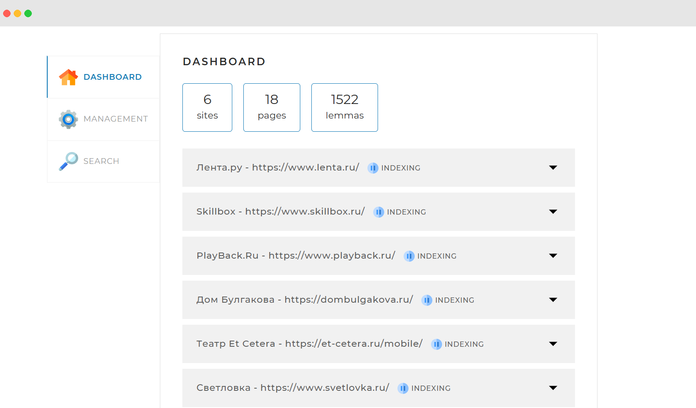
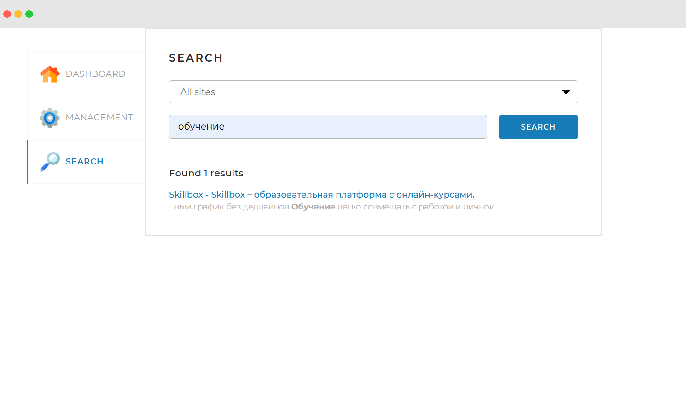

<h1 align="center">🔍 Local Search Engine</h1>

  

  
  
  
  

> **Локальный поисковый движок** — многопоточное Spring Boot приложение для обхода, индексации и поиска по сайтам с использованием морфологии Lucene.

##  Описание

**Local Search Engine** — это локальный поисковый сервис, который:
Обходит страницы заданных сайтов в многопоточном режиме.
Индексирует содержимое с использованием морфологического анализа.
Предоставляет поиск по API и веб-интерфейсу.
Выдаёт результаты с релевантностью и сниппетами.

Подходит для новостных порталов, корпоративных сайтов и проектов, где нужен быстрый поиск.

##  Стек технологий

  
  
  
  
  
  
  

##  Установка и запуск

1. **Клонировать репозиторий**
   git clone https://github.com/username/search-engine.git
   cd search-engine

2. **Создать базу данных MySQL**
   sql
   CREATE DATABASE search_engine;
   

3. **Настроить доступ в `application.yaml`**
   yaml
   spring:
     datasource:
       url: jdbc:mysql://localhost:3306/search_engine?useSSL=false&allowPublicKeyRetrieval=true
       username: root
       password: your_password
   

4. **Запустить проект**
   mvn spring-boot:run

5. **Открыть в браузере**
   http://localhost:8080

##  API

### Запуск индексации
GET /api/startIndexing

### Остановка индексации
GET /api/stopIndexing

### Индексация страницы
POST /api/indexPage
Content-Type: application/json
{
  "url": "https://example.com/page"
}

### Поиск
GET /api/search?query=слово&site=https://site.com

##  Скриншоты

###  Dashboard — Общая статистика

  

###  Management — Управление индексированием

  

###  Search — Результаты поиска

  

##  Особенности проекта
Многопоточный обход сайтов (ForkJoinPool).
Морфологический анализ текста (Lucene Morphology).
Оптимизированные запросы к БД.
REST API + Web UI (Thymeleaf).
Гибкая конфигурация через `application.yaml`.

